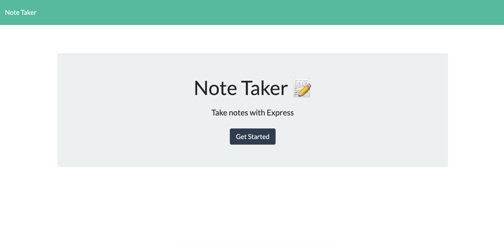
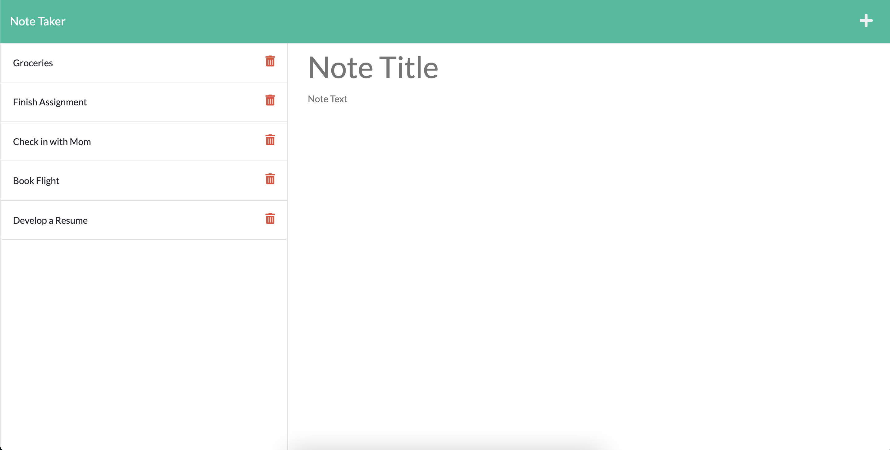
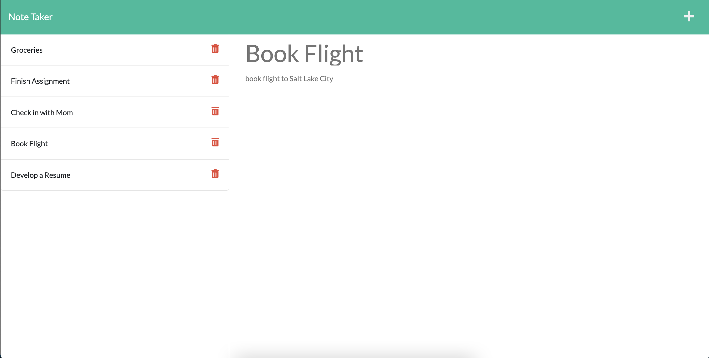

# 🏗️ Note Taker

Link : https://warm-taiga-44014.herokuapp.com/

## Description 📖

This is an application called Note Taker that can be used to write and save notes.

## Features 📝

Note Taker uses an Express.js back end to save and retrieve note data to and from a JSON file.

## Screenshots 📷 :

* User is presented with a landing page:

  
  
* User can add a note and save it to the application:

  

* User can click on an existing note and display it in the right column:

  
  

## Takeaways 💡

 I learned how to employ node modules to connect the front and back ends of an application, including Express.js and fs.

I also learned how to employ http methods to retrieve data from a database, as well as post and delete that data.

----
© 2021 Caswell Orr. Confidential and Proprietary. All Rights Reserved.
